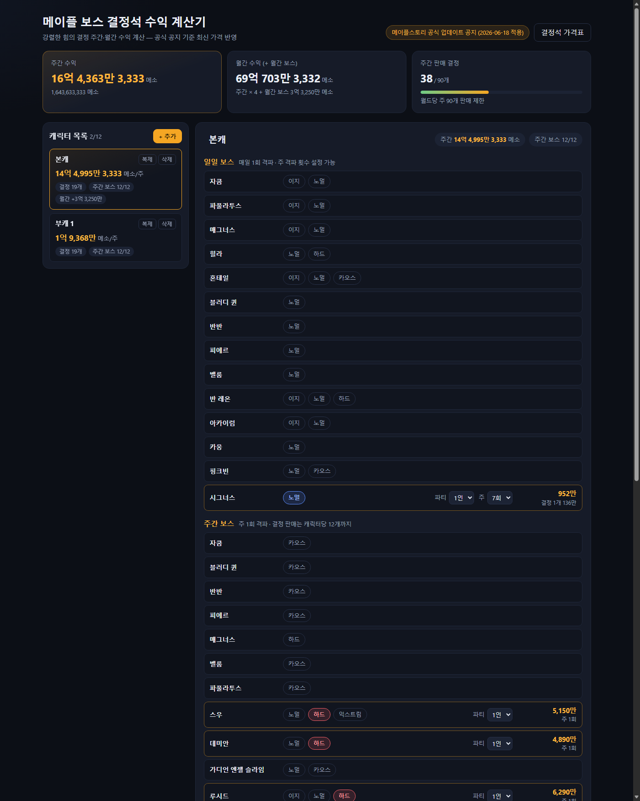

# 메이플 보스 결정석 수익 계산기

메이플스토리 보스 결정석(강렬한 힘의 결정) 주간/월간 수익을 계산하는 웹 앱입니다.
캐릭터를 추가하고 잡는 보스·난이도·파티 인원을 설정하면 게임 규칙(판매 제한 등)을 반영한
수익이 자동 계산됩니다.



## 실행 방법

```bash
npm install        # 최초 1회
npm run dev        # 개발 서버 (http://localhost:5173)
npm run build      # 프로덕션 빌드 (dist/)
npm run preview    # 빌드 결과 미리보기
npm test           # 계산 로직 단위 테스트
```

Vercel에 배포되어 있습니다 (https://maple-boss.vercel.app). `main` 브랜치 push 시 자동
배포됩니다. 캐릭터 조회 기능은 Vercel 서버리스 함수(`api/`)를 사용하므로 환경변수
`NEXON_API_KEY`(넥슨 Open API 키)가 필요합니다. 로컬에서 API까지 테스트하려면
`npx vercel dev`를 사용하세요 (`npx vercel env pull .env.local`로 키 동기화).

## 기능

- 캐릭터 최대 30개 관리 (이름 변경, 복제, 삭제 — 브라우저 localStorage에 자동 저장)
- 보스별 난이도 선택, 실제 난이도별 입장 상한에 맞는 파티 인원 설정
- 주간 보스 프리셋: 커뮤니티 통용 보스돌이 구성 6종(검밑솔 / 노세이칼 / 이적자 /
  하세이칼 / 이카 / 노칼이카)을 원클릭 적용. 하세이칼은 이지 대적자를 포함한 구성.
  현재 설정과 일치하는 프리셋은 자동 강조. 구성은 `src/data/presets.ts`에서 관리
  (나무위키 '보스돌이' 문서 기준, 수익 역산 검증)
- 주간 보스 12개 처치 제한: 13번째 주간 보스 선택 시 모달로 안내하고 추가를 차단
- 캐릭터 상세 페이지 (`#/c/캐릭터명`, 헤더 검색바로 진입): 프로필/전투력/핵심 스탯
  히어로 + 탭(장비·심볼·세트 / 스탯·하이퍼스탯·어빌리티·성향 / 유니온·아티팩트·챔피언 /
  링크 스킬·HEXA·V매트릭스 / 코디·안드로이드·펫). 탭별 지연 로딩으로 API 호출 절약,
  상세 조회는 `api/detail.ts` 프록시(파트 화이트리스트 + 초당 호출 제한 준수) 경유
- 캐릭터 불러오기 (넥슨 Open API 연동):
  - 캐릭터명 검색 — 사이트 API 키(서버 환경변수 `NEXON_API_KEY`)로 조회, 캐릭터
    이미지/월드/직업/레벨 표시. 서버리스 프록시 `api/character.ts` 경유로 키 비노출
  - 내 계정 캐릭터 — 방문자가 본인 API 키를 입력하면 계정 전체 캐릭터 목록을
    불러와 선택 추가 (`api/account.ts`, 키는 전달만 하고 저장하지 않음)
- 주간 수익 / 월간 수익(+월간 보스) / 주간 판매 결정 수 자동 집계
- 결정석 가격표 모달 (주간/월간 구분, 조회 날짜 기준 가격)

## 계산 규칙

| 규칙 | 처리 방식 |
| --- | --- |
| 파티 분배 | 결정석 가격 ÷ 인원수, 소수점 버림 |
| 주간 보스 판매 제한 (캐릭터당 12개) | 초과 선택 시 가격 높은 순 12개만 집계, 경고 표시 |
| 월드당 주간 판매 제한 (90개) | 초과 생산 시 가격 높은 순 90개만 집계, 손실액 표시 |
| 월간 보스 (검은 마법사) | 주간 수익 미포함, 월간 수익에만 합산 (판매 제한 계산에서 제외) |
| 월간 수익 | 주간 수익 × 4 + 월간 보스 수익 |

규칙 상수는 `src/data/crystalData.ts`의 `RULES`에 모여 있습니다.

## 가격 데이터 갱신

가격은 UI·계산 로직에 흩어 두지 않고 `src/data/crystalData.ts` 한 파일에서 관리합니다.

- 공식 출처: [메이플스토리 업데이트 공지](https://maplestory.nexon.com/news/update)
  ("강렬한 힘의 결정" 가격 조정이 포함된 공지). 현재 데이터 기준:
  [2026-06-18 결정석 개편 공지](https://maplestory.nexon.com/news/update/806),
  [2026-08-20 벨로나 추가 공지](https://maplestory.nexon.com/news/update/811)
- 각 난이도의 `prices`는 `{ price, since }` 목록입니다. 새 공지가 나오면 항목을 **추가**하세요.
  발효일(`since`)이 미래인 가격은 그 날짜가 되기 전까지 자동으로 기존 가격이 사용됩니다.
  (예: 검은 마법사 2026-07-01 적용 가격이 이 방식으로 처리되어 있습니다.)
- 보스 추가/삭제·일일/주간 전환(예: 2026-06-18 하드 힐라의 일일 보스 전환)도 이 파일에서 수정합니다.
- 수정 후 `npm test`로 계산 검증, `DATA_SOURCE.verifiedAt`을 확인일로 갱신하세요.

### 신규 보스 추가 체크리스트

1. `BOSSES`에 변경되지 않을 고유 `id`, 넥슨 스케줄러 `content_name`과 일치하는 `name`,
   `reset`, 공통 `maxPartySize`를 추가합니다.
2. `variants`에 난이도와 `{ price, since }`를 가격 오름차순으로 추가합니다.
   특정 난이도만 파티 상한이 다르면 variant의 `maxPartySize`로 재정의합니다.
3. `DATA_SOURCE`의 링크·설명·`verifiedAt`을 갱신합니다.
4. 커뮤니티에서 통용되는 보스돌이 구성이 확립된 경우에만 `src/data/presets.ts`를 변경합니다.
5. 스케줄러 이름 매핑, 결정 가격/발효일, 파티 상한과 과거 저장값 보정을 테스트하고
   `npm test`, `npm run build`를 실행합니다.

참고: 실제 판매 가격은 게임 내 NPC 콜렉터가 최종 기준입니다. 공식 홈페이지에는 상시
가격표 페이지가 없으므로 신규 보스 공지와 게임 내 가격을 함께 확인합니다.

## 로드맵 (선택 확장)

- 공지 API(`/maplestory/v1/notice-update`) 기반 가격 변경 자동 감지 + 관리자 승인 반영

## 면책

팬 제작 도구로 넥슨코리아와 무관합니다. 실제 판매 가격은 게임 내 NPC 콜렉터 기준이 우선합니다.
